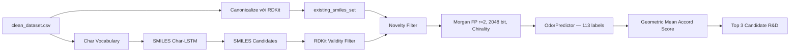
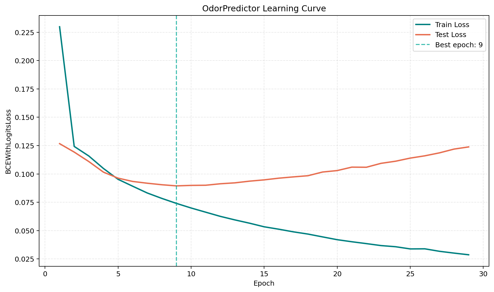

<div align="center">

# 🧪 AI Olfactory R&D Lab

**Nền tảng nghiên cứu hương liệu kết hợp dự đoán mùi đa nhãn và sinh phân tử SMILES**

[](https://www.python.org/)
[](https://pytorch.org/)
[](https://www.rdkit.org/)
[](https://streamlit.io/)
[](#giới-hạn--an-toàn-nghiên-cứu)

</div>

AI Olfactory R&D Lab là prototype phục vụ nghiên cứu mối quan hệ giữa **cấu trúc phân tử** và **hồ sơ mùi hương**. Hệ thống gồm hai thành phần:

- **The Judge** — nhận SMILES, tạo Morgan Fingerprint có xét chirality và dự đoán 113 nhãn mùi.
- **The Creator** — dùng Char-LSTM sinh SMILES mới, lọc hợp lệ bằng RDKit, loại trùng với dữ liệu gốc và xếp hạng bằng Judge.

Ứng dụng được đóng gói trong giao diện Streamlit hai tab với phong cách Teal/White, tối ưu cho macOS Apple Silicon qua MPS và tự động fallback về CPU.

## Mục lục

- [Tính năng chính](#tính-năng-chính)
- [Kiến trúc hệ thống](#kiến-trúc-hệ-thống)
- [Dữ liệu và mô hình](#dữ-liệu-và-mô-hình)
- [Cài đặt](#cài-đặt)
- [Chạy ứng dụng](#chạy-ứng-dụng)
- [Huấn luyện lại mô hình](#huấn-luyện-lại-mô-hình)
- [Cấu trúc repository](#cấu-trúc-repository)
- [Giới hạn và an toàn nghiên cứu](#giới-hạn--an-toàn-nghiên-cứu)

## Tính năng chính

### 🔍 Phân tích Phân tử — The Judge

- Nhận SMILES, bao gồm ký hiệu lập thể như `@`, `@@`, `/` và `\`.
- Chuẩn hóa và hiển thị **Isomeric SMILES** cùng **Canonical SMILES**.
- Vẽ cấu trúc 2D có Wedge/Dash để thể hiện thông tin stereochemistry khi đầu vào có khai báo.
- Tạo Morgan Fingerprint với `radius=2`, `nBits=2048`, `useChirality=True`.
- Hiển thị Top 5 nốt hương dự đoán dưới dạng xác suất.

### 🔮 Sáng tạo Captive — Creator + Judge

- Chọn một hoặc nhiều nốt hương mục tiêu từ 113 nhãn.
- Điều chỉnh Temperature từ `0.2` đến `1.2`.
- Char-LSTM sinh ứng viên SMILES; RDKit loại chuỗi sai cú pháp hoặc hóa trị.
- Canonical hóa và loại ứng viên đã có trong `clean_dataset.csv` bằng tra cứu `set` O(1).
- Auto-retry tối đa 200 lần để thu thập 5 ứng viên hợp lệ và không trùng trong batch.
- Tính **Accord Score** bằng trung bình nhân xác suất các nốt hương mục tiêu:

\[
\text{Accord Score} =
\left(\prod_{i=1}^{N} P(\text{target}_i)\right)^{1/N}
\]

- Xếp hạng Top 3 Candidate và hiển thị cấu trúc, SMILES, công thức hóa học, Exact MW, LogP, tầng hương cùng hồ sơ mùi dự đoán.

## Kiến trúc hệ thống



### The Judge — `OdorPredictor`

| Thành phần | Cấu hình |
|---|---|
| Input | Morgan Fingerprint 2.048 bit |
| Hidden 1 | Linear 2.048 → 1.024, ReLU, Dropout 0.3 |
| Hidden 2 | Linear 1.024 → 512, ReLU, Dropout 0.3 |
| Output | Linear 512 → 113 logits |
| Loss | `BCEWithLogitsLoss` |
| Optimizer | Adam, learning rate `0.001` |
| Training | Tối đa 100 epochs, Early Stopping patience 20 |

### The Creator — `SMILES_LSTM`

| Thành phần | Cấu hình |
|---|---|
| Tokenization | Character-level + `<PAD>` + `<END>` |
| Embedding | 128 chiều |
| LSTM | Hidden size 256, 2 layers, dropout 0.2 |
| Output | Linear 256 → vocabulary size |
| Loss | `CrossEntropyLoss(ignore_index=pad_idx)` |
| Optimizer | Adam, learning rate `0.002` |
| Training | Cố định 100 epochs |

## Dữ liệu và mô hình

| Tài nguyên | Nội dung |
|---|---|
| `clean_dataset.csv` | 3.522 SMILES đã chuẩn hóa cùng metadata mùi |
| `one_hot_dataset.csv` | 3.522 mẫu với 113 cột nhãn mùi one-hot |
| `odor_morgan_tensor_dataset.pt` | `X [3522, 2048]`, `Y [3522, 113]` và `label_names` |
| `odor_predictor_weights.pth` | Trọng số tốt nhất của Judge |
| `smiles_vocab.json` | Ánh xạ character ↔ index của Creator |
| `smiles_creator_weights.pth` | Trọng số Char-LSTM |
| `learning_curve.png` | Train/Test Loss của Judge |



## Cài đặt

### 1. Clone repository

```bash
git clone git@github.com:MutAquaticStudio/ai-olfactory-rd-lab.git
cd ai-olfactory-rd-lab
```

Repository hiện ở chế độ private, vì vậy tài khoản GitHub cần có quyền truy cập.

### 2. Tạo môi trường Python

```bash
python3 -m venv .venv
source .venv/bin/activate
python -m pip install --upgrade pip
```

### 3. Cài dependencies

```bash
python -m pip install -r tensor_dataset_requirements.txt
python -m pip install matplotlib
```

Các dependency chính: PyTorch, RDKit, Streamlit, Pandas, NumPy và Matplotlib.

## Chạy ứng dụng

Từ thư mục gốc của repository:

```bash
streamlit run app.py
```

Streamlit sẽ mở giao diện tại `http://localhost:8501`. Model và dữ liệu được cache để tránh nạp lại trong mỗi lần tương tác.

## Huấn luyện lại mô hình

### Huấn luyện Judge

```bash
python train_odor_model.py
```

Tùy chọn:

```bash
python train_odor_model.py \
  --epochs 100 \
  --batch-size 64 \
  --learning-rate 0.001 \
  --seed 42
```

Script tái tạo fingerprint có chirality trực tiếp từ `clean_dataset.csv`, chia dữ liệu 80/20 và:

- lưu best weights vào `odor_predictor_weights.pth`;
- dừng sớm nếu Test Loss không cải thiện trong 20 epochs;
- xuất learning curve vào `learning_curve.png`;
- khôi phục best model và in Top 3 dự đoán cho một mẫu test ngẫu nhiên.

### Huấn luyện Creator

```bash
python train_creator.py
```

Tùy chọn:

```bash
python train_creator.py \
  --batch-size 64 \
  --learning-rate 0.002 \
  --start-str C \
  --max-len 60 \
  --seed 42
```

Script đọc SMILES từ `clean_dataset.csv`, tạo lại `smiles_vocab.json`, huấn luyện đủ 100 epochs, lưu `smiles_creator_weights.pth` và sinh thử 10 mẫu với `temperature=0.8`.

## Cấu trúc repository

```text
.
├── app.py                              # Ứng dụng Streamlit Judge + Creator
├── train_odor_model.py                 # Huấn luyện mô hình dự đoán mùi
├── train_creator.py                    # Huấn luyện Char-LSTM sinh SMILES
├── clean_dataset.csv                   # Dataset SMILES đã làm sạch
├── ready_dataset.csv                   # Dataset sau bước thu thập/chuẩn hóa cột
├── one_hot_dataset.csv                 # Nhãn mùi one-hot
├── odor_morgan_tensor_dataset.pt       # TensorDataset X/Y + label_names
├── odor_predictor_weights.pth          # Best weights của Judge
├── smiles_vocab.json                   # Character vocabulary
├── smiles_creator_weights.pth          # Weights của Creator
├── learning_curve.png                  # Biểu đồ loss
├── tensor_dataset_requirements.txt     # Python dependencies chính
└── .streamlit/
    └── config.toml                     # Theme Teal/White
```

## Giới hạn & an toàn nghiên cứu

> [!IMPORTANT]
> Đây là **research prototype**, không phải công cụ xác nhận mùi, độc tính, độ ổn định, khả năng tổng hợp hay tính tuân thủ pháp lý của một hợp chất.

- Xác suất đầu ra là dự đoán thống kê từ dữ liệu huấn luyện, không thay thế đánh giá cảm quan hoặc phép đo phòng thí nghiệm.
- Nhãn **“100% Novel Captive”** chỉ có nghĩa Canonical SMILES chưa xuất hiện trong `clean_dataset.csv` và chưa trùng trong batch hiện tại. Nó **không chứng minh** phân tử mới đối với PubChem, ChEMBL, SciFinder, Reaxys, patent database hoặc prior art.
- SMILES hợp lệ theo RDKit vẫn có thể đại diện cho phân tử khó tổng hợp, không bền, độc hại hoặc không phù hợp để sử dụng trong hương liệu.
- Trước mọi thử nghiệm thực tế, cần đánh giá độc tính, IFRA, SDS, quy định địa phương, khả năng tổng hợp và quyền sở hữu trí tuệ bởi chuyên gia phù hợp.

## License

Repository chưa phát hành kèm giấy phép mã nguồn mở. Mọi quyền được bảo lưu cho đến khi có file `LICENSE` chính thức.

---

<div align="center">
  <sub>Built for molecular olfaction research with PyTorch, RDKit and Streamlit.</sub>
</div>
