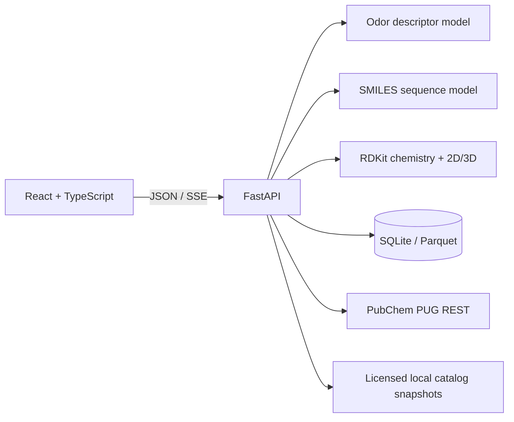
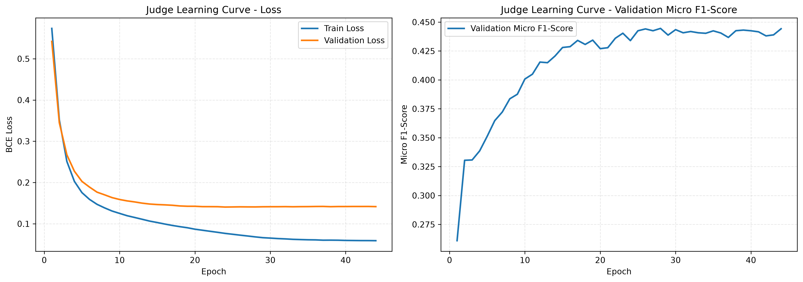

# Scent Molecule Studio

**English** | [Tiếng Việt](README_VI.md)

Structure analysis and candidate design for fragrance R&D.

[](https://github.com/MutAquaticStudio/ai-olfactory-rd-lab/actions/workflows/tests.yml)
[](https://www.python.org/)
[](https://react.dev/)
[](https://fastapi.tiangolo.com/)
[](#research-boundaries)

Scent Molecule Studio is a local-first research platform for inspecting odorant
structures, reviewing predicted odor descriptors, generating candidate SMILES,
and collecting traceable sensory observations. A React/Vite workspace talks to
a single FastAPI process backed by PyTorch and RDKit.

The product keeps four kinds of evidence separate:

- **Prediction** — model probabilities for 113 odor descriptors.
- **Chemistry screening** — configured structural and physicochemical rules.
- **Reference verification** — identity and fragrance-catalog lookups.
- **Experimental evidence** — sensory assessments with explicit provenance.

It does not present generated structures as experimentally validated molecules
or interpret a reference-source no-match as global novelty.

## Workspace

### Molecule analysis

- Parse and standardize a SMILES string with RDKit.
- Display canonical and Isomeric SMILES plus a stereochemical 2D depiction.
- Require stereo resolution before chiral prediction or 3D modeling.
- Predict 113 descriptors from a 2,048-bit Morgan fingerprint
  (`radius=2`, `useChirality=True`).
- Project the flat output onto 11 Osmo-compatible primary facets, textures, and
  sensations; the non-zero raw output remains available in a disclosure.
- Build a high-fidelity ETKDGv3 ensemble and display up to five converged,
  RMSD-clustered representatives with relative force-field energy.
- Report chemistry-screen decisions, descriptors, model version, dataset
  version, applicability-domain similarity, and reliability state.

Unresolved structures show at most 16 stereoisomers. Prediction and 3D stay
locked until a fully specified variant is selected. The same Isomeric SMILES is
then used by both the chiral fingerprint and conformer pipeline.

### Candidate design

- Select up to three target descriptors and a sampling-diversity value.
- Disable descriptors with insufficient assessed support; distinguish
  `SUPPORTED` from `LIMITED_EVIDENCE` descriptors in the selector.
- Stream generation and screening progress with a cancellable request.
- Remove invalid, duplicate, unresolved, rejected, known, and unverified
  structures before ranking.
- Auto-enumerate at most four stereo variants per candidate and keep at most one
  representative per connectivity.
- Score the chemistry-valid pool before PubChem, 3D, academic, or route work.
  A promoted conditional SELFIES artifact receives selected targets plus
  assessed/intensity masks; the current Char-LSTM remains a disclosed fallback.
- Rank with an uncertainty-penalized geometric target-fit score:

```text
conservative_i = max(0, ensemble_mean_i - 1.64 × ensemble_std_i)
Robust target fit = exp(mean(log(conservative_i)))
```

- For calibrated `SUPPORTED` descriptors, a strict match requires every target
  to reach 30% and robust target fit to reach 40%. Limited-evidence descriptors
  use frozen calibration thresholds and are not presented as absolute 40/30
  probabilities.
- If fewer than three structures meet the requested gate, relax both floors in
  transparent 0.05 steps. Every such result is marked `RELAXED`, records the
  applied threshold, and states that the requested threshold was not met.
- Display up to three candidates with 2D/3D structure, descriptors, target
  evidence, uncertainty, applicability domain, reference evidence, academic
  citations, Ertl SAscore, and optional AiZynthFinder route evidence.
- Keep chemistry and reference-review items outside the shortlist.

The loop stops at five accepted structures, 200 attempts, or 120 seconds.
Results and controls survive navigation between workspace routes but remain
session-only and are cleared by a full browser refresh.

### Data intake

- Record a manual blinded sensory assessment.
- Import CSV or XLSX through `Upload → Validate → Preview → Commit`.
- Preserve `PRESENT`, `ABSENT`, and `UNASSESSED` as distinct label states.
- Validate structure, stereo, descriptor vocabulary, units, duplicates,
  identifiers, experimental fields, and source provenance.
- Store append-only source records and create immutable Parquet snapshots with
  SHA-256 manifests.

Local scientific data defaults to `~/.scent-molecule-studio/` and is excluded
from Git. Set `SCENT_STUDIO_DATA_DIR` to use another private location.

## Architecture



- FastAPI loads models, vocabulary, taxonomy, and the local reference set once
  during application lifespan.
- Production local mode uses one worker to avoid duplicating model and Apple MPS
  memory.
- FastAPI serves `/api/v1/*` and the built React single-page application from
  the same origin.
- Candidate status uses Server-Sent Events; no Redis, Celery, or background job
  system is required.

### Accuracy-first training architecture

The web process never imports DeepChem or Chemprop.  Both the legacy Morgan
baseline and future graph models implement the same `MoleculePredictor` /
`PredictionBatch` contract (`olfactory/prediction.py`).  The registered Judge
v1 remains production until a candidate passes the locked chemical-group test,
calibration, intensity, and blind-panel gates.

Judge v2 experiments run in a separate environment.  Chemprop is the first
graph benchmark and `olfactory/training/deepchem_judge.py` is an optional
DeepChem adapter using `MolGraphConvFeaturizer(use_edges=True,
use_chirality=True)`.  DeepChem artifacts are immutable candidates under
`artifacts/judge/<run_id>/`; training never overwrites `odor_predictor_weights.pth`
and never promotes a registry entry implicitly.  Install it only when needed:

```bash
python3.11 -m venv .venv-training
source .venv-training/bin/activate
python -m pip install -r requirements-deepchem.txt
```

Create the shared 60/10/15/15 split once and reuse its checksum for every model:

```bash
python build_split_manifest.py --legacy-baseline
python benchmark_baselines.py --legacy-baseline \
  --split-manifest artifacts/benchmarks/split_manifest.json
```

Stereo variants are grouped by connectivity InChIKey; cyclic structures are
grouped by Murcko scaffold and acyclic structures by Butina Morgan similarity.
Random splits are diagnostic only. Early stopping uses validation; probability
calibration and descriptor thresholds use only the dedicated calibration
partition; the locked test is never used for tuning.

## Requirements

- Python `>=3.10,<3.13`
- Node.js 20 or newer
- macOS, Linux, or Windows supported by the selected PyTorch/RDKit wheels
- Apple MPS is used when available; CPU is the fallback

The training-only Chemprop stack currently requires Python 3.11–3.12. The web
application and baseline inference support Python 3.10–3.12.

## Quick start

```bash
git clone git@github.com:MutAquaticStudio/ai-olfactory-rd-lab.git
cd ai-olfactory-rd-lab

python3.12 -m venv .venv
source .venv/bin/activate
python -m pip install --upgrade pip
python -m pip install -r requirements.txt

cd frontend
npm ci
cd ..

# Configure the private model bundle (not stored in Git)
export SCENT_STUDIO_RESOURCE_DIR="$HOME/.scent-molecule-studio/resources"
# Copy the three approved files into this directory, then create its checksum manifest:
python scripts/prepare_resource_bundle.py \
  --source /path/to/private/model-bundle \
  --target "$SCENT_STUDIO_RESOURCE_DIR"

PYTHON_BIN=.venv/bin/python ./run_local.sh
```

Open [http://127.0.0.1:8000](http://127.0.0.1:8000). The production launcher
binds only to `127.0.0.1` and starts one Uvicorn worker.

Override the port or interpreter when needed:

```bash
PYTHON_BIN=python3.11 PORT=8080 ./run_local.sh
```

### Development mode

Run the API and Vite dev server in separate terminals:

```bash
# Terminal 1
.venv/bin/python -m uvicorn olfactory.api:app \
  --host 127.0.0.1 --port 8000 --workers 1

# Terminal 2
cd frontend
npm run dev
```

Vite proxies `/api` to the FastAPI process during development.

## Model resources

The production application keeps model binaries outside Git in a private,
checksum-verified resource bundle. Set `SCENT_STUDIO_RESOURCE_DIR` to the
bundle directory before starting the API. The bundle contains:

| Private resource | Contract |
|---|---|
| `odor_morgan_tensor_dataset.pt` | `X [3522, 2048]`, `Y [3522, 113]`, ordered labels |
| `odor_predictor_weights.pth` | `2048 → 1024 → 512 → 113` descriptor model |
| `smiles_creator_weights.pth` | Two-layer character LSTM weights |
| `resource_manifest.json` | SHA-256 checksums for all private resources |

Use `scripts/prepare_resource_bundle.py` to copy resources atomically and write
the manifest. The loader verifies every checksum before loading a model; no
model binary is downloaded automatically.

The repository keeps only small, non-secret runtime metadata:

| Resource | Contract |
|---|---|
| `clean_dataset.csv` | Local reference structures and catalog odor metadata |
| `smiles_vocab.json` | Character vocabulary with `<PAD>` and `<END>` |
| `model_registry.json` | Active model/data/calibration metadata |

The current private weights are registered as a legacy scientific baseline.
The web migration does not retrain or alter them. Candidate Judge v2 and
Creator v2 artifacts are written under ignored `artifacts/` paths and never
overwrite the baseline bundle.

If the resource bundle is missing or a checksum does not match, `run_local.sh`
stops with a setup message and the API health endpoint reports a stable
resource error. Keep the bundle in a private location and do not commit it.

The current local clean-master experiment is stored as non-production
artifacts under `artifacts/judge/clean-master-leakage-v2/` and
`artifacts/creator/clean-master-char-lstm-v1/`. The Judge candidate has 254
taxonomy outputs and a BatchNorm MLP, so it is intentionally not loadable by
the 113-output production adapter. Its manifest and checksums are retained for
benchmarking and rollback-safe review; do not copy it into the private bundle
without an audited 113-label snapshot and a passing quality gate.

### Clean-master candidate learning curve

The chart below is from the leakage-resistant
`judge-clean-master-leakage-v2-20260902` candidate run. Connectivity variants
remain in one partition; cyclic molecules are grouped by Murcko scaffold and
acyclic molecules by Butina similarity. The fixed split contains 2,781 training,
472 calibration, 697 validation, and 779 locked-test rows.



| Recorded metric | Result |
|---|---:|
| Best validation BCE loss | `0.1405` at epoch 24 |
| Best validation micro F1 | `0.4445` at epoch 28 |
| Locked-test BCE loss | `0.1459` |
| Locked-test micro F1, fixed threshold | `0.4266` |

These values describe a 254-label weak-taxonomy candidate, not the registered
113-label production model. They are retained as reproducible training evidence
and do not satisfy the promotion gate by themselves.

### Retraining readiness

Preflight on 2026-09-04 found 4,729 unique Isomeric SMILES in the private
`clean_master_olfactory_db.csv`. Its `odor_types` and `odor_descriptors` fields
currently expand to 254 weak-taxonomy labels, while the production prediction
contract requires exactly 113 ordered descriptors. The catalog also records
mentions rather than reviewed `PRESENT / ABSENT / UNASSESSED` assessments and
does not contain panel intensity measurements.

For those reasons, this release does **not** launch or promote a production
retraining run. Reusing the existing 254-output checkpoint as if it were the
113-output Judge would silently change the API contract and convert missing
catalog mentions into unreliable negatives. The correct retraining sequence is:

1. Review and version an explicit 254-to-113 ontology mapping; preserve
   unmapped source terms and do not infer `ABSENT` from a missing mention.
2. Commit reviewed sensory records to an immutable 113-label Parquet snapshot
   with structure, source, license, stereo, and assessment provenance.
3. Freeze one 60/10/15/15 connectivity/scaffold split and run the logistic,
   Morgan, Chemprop, and DeepChem candidates on the same snapshot.
4. Fit calibration only on the calibration partition, select with validation,
   and open the locked test once for the final comparison.
5. Promote a five-seed ensemble only after the documented metric, calibration,
   applicability-domain, and prospective-panel gates pass.

Until that gate is met, the application keeps Judge v1 and Char-LSTM v1 as the
rollback-safe production baseline. Target matching from this release remains
transparent: uncalibrated output is shown as a score and can never be labeled a
strict 40/30 match.

## API

| Endpoint | Purpose |
|---|---|
| `GET /api/v1/health` | Server and model-resource readiness |
| `GET /api/v1/meta` | Labels, limits, capabilities, versions, and providers |
| `POST /api/v1/analysis` | Structure, stereo state, screen, prediction, and 3D |
| `POST /api/v1/candidates/stream` | SSE candidate progress and completed ranking |
| `POST /api/v1/academic/evidence/query` | Query local, citation-bound structure evidence |
| `GET /api/v1/academic/evidence/{evidence_id}` | Retrieve one evidence record and provenance |
| `GET /api/v1/academic/sources` | List indexed academic source records |
| `GET /api/v1/data/templates` | Intake schema or CSV template |
| `POST /api/v1/data/imports/validate` | Validate and stage a CSV/XLSX upload |
| `POST /api/v1/data/imports/commit` | Commit a validated import token |
| `POST /api/v1/assessments/validate` | Validate a manual sensory record |
| `POST /api/v1/assessments` | Append a validated sensory record |
| `GET /api/v1/datasets/versions` | List immutable local dataset snapshots |

Product errors use stable codes and plain-language messages. Technical details
remain collapsed in the UI; API responses do not expose stack traces.

## Academic evidence

`academic_rag_pipeline.py ingest` now writes derived structure mentions to
`faiss_academic_index/academic_evidence.jsonl` alongside the local FAISS
batches. Each record retains the paper identifier, DOI/link, content hash,
full-text versus abstract provenance, excerpt span, RDKit normalization log,
and review state. Extraction is candidate generation only: records start as
`UNREVIEWED`, odor descriptors remain `UNASSESSED`, and no raw PDF or abstract
is imported into model training automatically.

The evidence API only promotes an `EXACT_MATCH` after a reviewer accepts a
stereo-aware RDKit identity with citation provenance. Name-only mentions,
salts, unresolved stereochemistry, identifier conflicts, and abstract-only
records remain reviewable rather than being treated as exact evidence. The
default query excludes abstract fallback (`include_abstracts=false`).

Academic retrieval is local-first and fail-closed. Open-access documents are
temporary extraction inputs and are deleted after processing; no paywall is
crossed and full text is not sent to an external service. A computational
chemistry `PASS` or an academic identity match is not a safety, IFRA,
synthesis, novelty, patent-clearance, or experimental-validation conclusion.

## Stereo and conformer policy

The analysis contract has three states:

- `STEREO_REQUIRED` — a bounded list of variants can be selected.
- `STEREO_INPUT_REQUIRED` — too many variants; enter fully specified Isomeric
  SMILES manually.
- `COMPLETE` — chiral prediction and conformer modeling may run.

For complete structures, the conformer service requests 50 ETKDGv3 conformers
or 100 for protected macrocycles. It enforces chirality, uses macrocycle torsion
and 1–4 bounds, retries MMFF94s minimization, and falls back to a separate UFF
ensemble only when no MMFF conformer converges. Energies from different force
fields are never mixed.

Non-finite coordinates, heavy-atom clashes, connectivity changes, stereo
round-trip changes, and unconverged conformers are removed. Representatives are
clustered by heavy-atom RMSD and ordered by relative energy. The first displayed
representative has `ΔE = 0`.

## Chemistry and reference gates

The chemistry screen returns `PASS`, `REVIEW`, or `REJECT`. Only `PASS` can be
shortlisted. A protected macrocycle profile permits non-aromatic 15–17 member
rings within its dedicated descriptor limits.

Reference eligibility is fail-closed:

```text
chemistry PASS
AND PubChem NO_MATCH
AND every enabled fragrance catalog NO_MATCH
```

PubChem is queried through PUG REST `fastidentity` with
`identity_type=same_stereo_isotope`. No identifier is transmitted until the
user grants session consent. `MATCH`, `AMBIGUOUS`, and `UNVERIFIED` results do
not enter the shortlist.

TGSC and ScenTree adapters only accept licensed local snapshots. They do not
scrape websites and remain `NOT_CONFIGURED` unless an operator supplies a valid
manifest outside Git:

```bash
export TGSC_REFERENCE_MANIFEST=/private/references/tgsc-manifest.json
export SCENTREE_REFERENCE_MANIFEST=/private/references/scentree-manifest.json
```

A no-match result means only that no matching indexed record was found in the
configured sources. It is not global novelty, commercial exclusivity, safety,
or patent clearance.

## Scientific development

Install the separate training stack with Python 3.11–3.12:

```bash
python3.12 -m venv .venv-training
source .venv-training/bin/activate
python -m pip install -r requirements-training.txt
```

Legacy v1 training entrypoints and intermediate CSV exports are not part of
the production checkout. The v2 benchmark scripts read the private tensor
dataset from `SCENT_STUDIO_RESOURCE_DIR`; set that variable before running a
legacy-baseline audit or benchmark.

Core workflows:

```bash
# Audit the legacy weak-label baseline
python audit_accuracy.py

# Fixed grouped-split baselines
python benchmark_baselines.py --snapshot /private/path/data-version.parquet

# Grouped CV for Judge v2
python benchmark_judge_v2.py --snapshot /private/path/data-version.parquet

# Optional DeepChem graph candidate (training environment only)
python train_deepchem_judge.py --legacy-baseline \
  --split-manifest artifacts/benchmarks/split_manifest.json

# Candidate model artifacts; never auto-promoted
python train_judge_v2.py --snapshot /private/path/data-version.parquet
python train_creator_v2.py --snapshot /private/path/data-version.parquet \
  --target-descriptors fruity,floral \
  --target-score-benchmark /private/path/target-score-benchmark.npz
```

Development splits group by connectivity InChIKey, then Murcko scaffold for
cyclic structures or Butina clustering for acyclic structures. Random split is
diagnostic only. The immutable split is 60% training, 10% calibration, 15%
validation, and 15% locked test. Calibration and descriptor thresholds use
only the calibration partition; early stopping uses validation; the locked
test is evaluated only after model selection.

Judge and Creator runs write `learning_curve.png`, machine-readable CSV/JSON
history, metrics, configuration, split metadata, and SHA-256 checksums into
their immutable artifact directory. Creator promotion also requires an
equal-budget conditional-versus-unconditional benchmark with positive
bootstrap confidence and target-count coverage gates.

AiZynthFinder is an optional evidence adapter, not a runtime dependency or a
synthesis guarantee. Configure it only in the training/R&D environment:

```bash
export SCENT_STUDIO_AIZYNTH_CONFIG=/private/path/to/aizynthfinder.yml
```

If it is absent, the API returns `NOT_CONFIGURED`; SAscore remains a separate
heuristic and neither value changes the odor target-fit score.

See [Scientific protocol](docs/SCIENTIFIC_PROTOCOL.md) for provenance schema,
panel protocol, benchmark metrics, promotion gates, uncertainty, blind-panel
validation, and Creator v2 criteria.

## Testing

```bash
# Backend unit and API contracts
.venv/bin/python -m pytest -q

# Frontend unit tests and production build
cd frontend
npm test
npm run build

# Desktop/mobile browser workflows
npx playwright install chromium
npm run test:e2e
```

CI runs backend tests on Python 3.10 and 3.12 and frontend tests on Node 22,
including desktop/mobile Playwright and accessibility checks.

## Project layout

```text
.
├── frontend/                 React, Vite, TypeScript, Vitest, Playwright
├── olfactory/                FastAPI and molecular application services
│   ├── data_foundation/      Intake, provenance, SQLite, snapshots
│   ├── rag/                  RAG service boundary and FAISS batch adapters
│   └── training/             Split, metrics, calibration, Chemprop/DeepChem candidates
├── data/                     Taxonomy mapping and source registry metadata
├── docs/                     Scientific protocol and research documentation
├── tests/                    Python unit and API contract tests
├── run_local.sh              One-command local production launcher
└── model_registry.json       Atomic production model selection
```

Academic retrieval is isolated from model training.  The compatibility CLI
`academic_rag_pipeline.py` delegates through `olfactory/rag/`, stores only
local FAISS batches, and falls back to an abstract when licensed open-access
full text is unavailable.  Retrieved academic text is context, never an
automatic sensory label.

## Taxonomy and component attribution

The repository vendors an explicit 113-label mapping for an
**Osmo-compatible projection**. Category scores use weighted maximum; runtime
does not fuzzy-map labels. No affiliation with or endorsement by Osmo is
implied.

- [Osmo Scent Taxonomy](https://github.com/osmoai/taxonomy)
- [ODbL attribution notice](data/OSMO_ODBL_NOTICE.md)
- [Versioned mapping](data/odor_taxonomy_mapping_v1_2.json)

Application-scoped Animated Content, Animated List, Spotlight Card, and Count Up
components are adapted from [React Bits](https://www.reactbits.dev/). The
vendored notice is at
[`frontend/src/vendor/reactbits/NOTICE.md`](frontend/src/vendor/reactbits/NOTICE.md).

## Research boundaries

- Model outputs are predictions, not measured sensory observations.
- Taxonomy projection reorganizes model output; it does not add evidence.
- The 3D ensemble is an in-vacuum force-field calculation, not X-ray, NMR,
  molecular dynamics, DFT, or a thermodynamic ensemble.
- Chemistry screening is triage, not toxicity, IFRA, synthesis, regulatory, or
  experimental-volatility assessment.
- Generated candidates require expert review and laboratory validation before
  real-world use.
- Weak catalog labels contain missing and conflicting evidence; an omitted term
  is not automatically a negative observation.
- Applicability-domain similarity and uncertainty are warnings, not guarantees
  of correctness.
