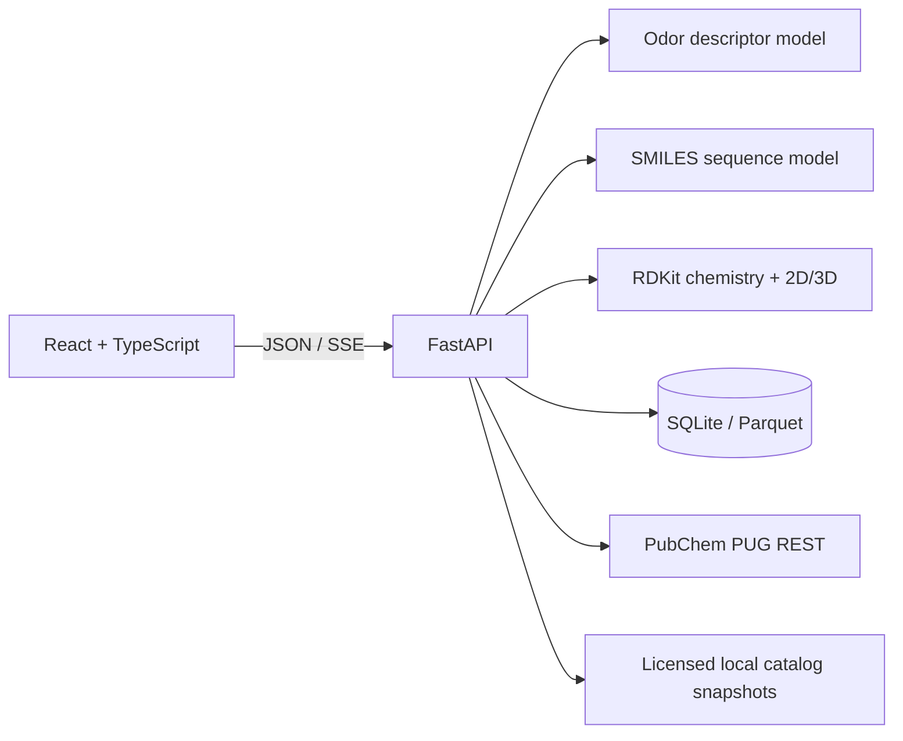

# Scent Molecule Studio

Structure analysis and candidate design for fragrance R&D.

[](https://github.com/MutAquaticStudio/ai-olfactory-rd-lab/actions/workflows/tests.yml)
[](https://www.python.org/)
[](https://react.dev/)
[](https://fastapi.tiangolo.com/)
[](#research-boundaries)

Scent Molecule Studio is a local-first research platform for inspecting odorant
structures, reviewing predicted odor descriptors, generating candidate SMILES,
and collecting traceable sensory observations. A React/Vite workspace talks to
a single FastAPI process backed by PyTorch and RDKit.

The product keeps four kinds of evidence separate:

- **Prediction** — model probabilities for 113 odor descriptors.
- **Chemistry screening** — configured structural and physicochemical rules.
- **Reference verification** — identity and fragrance-catalog lookups.
- **Experimental evidence** — sensory assessments with explicit provenance.

It does not present generated structures as experimentally validated molecules
or interpret a reference-source no-match as global novelty.

## Workspace

### Molecule analysis

- Parse and standardize a SMILES string with RDKit.
- Display canonical and Isomeric SMILES plus a stereochemical 2D depiction.
- Require stereo resolution before chiral prediction or 3D modeling.
- Predict 113 descriptors from a 2,048-bit Morgan fingerprint
  (`radius=2`, `useChirality=True`).
- Project the flat output onto 11 Osmo-compatible primary facets, textures, and
  sensations; the non-zero raw output remains available in a disclosure.
- Build a high-fidelity ETKDGv3 ensemble and display up to five converged,
  RMSD-clustered representatives with relative force-field energy.
- Report chemistry-screen decisions, descriptors, model version, dataset
  version, applicability-domain similarity, and reliability state.

Unresolved structures show at most 16 stereoisomers. Prediction and 3D stay
locked until a fully specified variant is selected. The same Isomeric SMILES is
then used by both the chiral fingerprint and conformer pipeline.

### Candidate design

- Select one or more target descriptors and a sampling-diversity value.
- Stream generation and screening progress with a cancellable request.
- Remove invalid, duplicate, unresolved, rejected, known, and unverified
  structures before ranking.
- Auto-enumerate at most four stereo variants per candidate and keep at most one
  representative per connectivity.
- Rank accepted candidates with the existing geometric target-fit score:

```text
Target fit = exp(mean(log(P(selected target descriptors))))
```

- Display the top three candidates with 2D/3D structure, descriptors, target
  probabilities, supporting descriptors, chemistry evidence, and reference
  evidence.
- Keep chemistry and reference-review items outside the shortlist.

The loop stops at five accepted structures, 200 attempts, or 120 seconds.
Results and controls survive navigation between workspace routes but remain
session-only and are cleared by a full browser refresh.

### Data intake

- Record a manual blinded sensory assessment.
- Import CSV or XLSX through `Upload → Validate → Preview → Commit`.
- Preserve `PRESENT`, `ABSENT`, and `UNASSESSED` as distinct label states.
- Validate structure, stereo, descriptor vocabulary, units, duplicates,
  identifiers, experimental fields, and source provenance.
- Store append-only source records and create immutable Parquet snapshots with
  SHA-256 manifests.

Local scientific data defaults to `~/.scent-molecule-studio/` and is excluded
from Git. Set `SCENT_STUDIO_DATA_DIR` to use another private location.

## Architecture



- FastAPI loads models, vocabulary, taxonomy, and the local reference set once
  during application lifespan.
- Production local mode uses one worker to avoid duplicating model and Apple MPS
  memory.
- FastAPI serves `/api/v1/*` and the built React single-page application from
  the same origin.
- Candidate status uses Server-Sent Events; no Redis, Celery, or background job
  system is required.

## Requirements

- Python `>=3.10,<3.13`
- Node.js 20 or newer
- macOS, Linux, or Windows supported by the selected PyTorch/RDKit wheels
- Apple MPS is used when available; CPU is the fallback

The training-only Chemprop stack currently requires Python 3.11–3.12. The web
application and baseline inference support Python 3.10–3.12.

## Quick start

```bash
git clone git@github.com:MutAquaticStudio/ai-olfactory-rd-lab.git
cd ai-olfactory-rd-lab

python3.12 -m venv .venv
source .venv/bin/activate
python -m pip install --upgrade pip
python -m pip install -r requirements.txt

cd frontend
npm ci
cd ..

PYTHON_BIN=.venv/bin/python ./run_local.sh
```

Open [http://127.0.0.1:8000](http://127.0.0.1:8000). The production launcher
binds only to `127.0.0.1` and starts one Uvicorn worker.

Override the port or interpreter when needed:

```bash
PYTHON_BIN=python3.11 PORT=8080 ./run_local.sh
```

### Development mode

Run the API and Vite dev server in separate terminals:

```bash
# Terminal 1
.venv/bin/python -m uvicorn olfactory.api:app \
  --host 127.0.0.1 --port 8000 --workers 1

# Terminal 2
cd frontend
npm run dev
```

Vite proxies `/api` to the FastAPI process during development.

## Model resources

The checked-in baseline application expects these resources in the repository
root:

| Resource | Contract |
|---|---|
| `clean_dataset.csv` | Local reference structures and catalog odor metadata |
| `odor_morgan_tensor_dataset.pt` | `X [3522, 2048]`, `Y [3522, 113]`, ordered labels |
| `odor_predictor_weights.pth` | `2048 → 1024 → 512 → 113` descriptor model |
| `smiles_vocab.json` | Character vocabulary with `<PAD>` and `<END>` |
| `smiles_creator_weights.pth` | Two-layer character LSTM weights |
| `model_registry.json` | Active model/data/calibration metadata |

The current weights are registered as a legacy scientific baseline. The web
migration does not retrain or alter them. Candidate Judge v2 and Creator v2
artifacts are written under ignored `artifacts/` paths and never overwrite the
baseline files.

## API

| Endpoint | Purpose |
|---|---|
| `GET /api/v1/health` | Server and model-resource readiness |
| `GET /api/v1/meta` | Labels, limits, capabilities, versions, and providers |
| `POST /api/v1/analysis` | Structure, stereo state, screen, prediction, and 3D |
| `POST /api/v1/candidates/stream` | SSE candidate progress and completed ranking |
| `GET /api/v1/data/templates` | Intake schema or CSV template |
| `POST /api/v1/data/imports/validate` | Validate and stage a CSV/XLSX upload |
| `POST /api/v1/data/imports/commit` | Commit a validated import token |
| `POST /api/v1/assessments/validate` | Validate a manual sensory record |
| `POST /api/v1/assessments` | Append a validated sensory record |
| `GET /api/v1/datasets/versions` | List immutable local dataset snapshots |

Product errors use stable codes and plain-language messages. Technical details
remain collapsed in the UI; API responses do not expose stack traces.

## Stereo and conformer policy

The analysis contract has three states:

- `STEREO_REQUIRED` — a bounded list of variants can be selected.
- `STEREO_INPUT_REQUIRED` — too many variants; enter fully specified Isomeric
  SMILES manually.
- `COMPLETE` — chiral prediction and conformer modeling may run.

For complete structures, the conformer service requests 50 ETKDGv3 conformers
or 100 for protected macrocycles. It enforces chirality, uses macrocycle torsion
and 1–4 bounds, retries MMFF94s minimization, and falls back to a separate UFF
ensemble only when no MMFF conformer converges. Energies from different force
fields are never mixed.

Non-finite coordinates, heavy-atom clashes, connectivity changes, stereo
round-trip changes, and unconverged conformers are removed. Representatives are
clustered by heavy-atom RMSD and ordered by relative energy. The first displayed
representative has `ΔE = 0`.

## Chemistry and reference gates

The chemistry screen returns `PASS`, `REVIEW`, or `REJECT`. Only `PASS` can be
shortlisted. A protected macrocycle profile permits non-aromatic 15–17 member
rings within its dedicated descriptor limits.

Reference eligibility is fail-closed:

```text
chemistry PASS
AND PubChem NO_MATCH
AND every enabled fragrance catalog NO_MATCH
```

PubChem is queried through PUG REST `fastidentity` with
`identity_type=same_stereo_isotope`. No identifier is transmitted until the
user grants session consent. `MATCH`, `AMBIGUOUS`, and `UNVERIFIED` results do
not enter the shortlist.

TGSC and ScenTree adapters only accept licensed local snapshots. They do not
scrape websites and remain `NOT_CONFIGURED` unless an operator supplies a valid
manifest outside Git:

```bash
export TGSC_REFERENCE_MANIFEST=/private/references/tgsc-manifest.json
export SCENTREE_REFERENCE_MANIFEST=/private/references/scentree-manifest.json
```

A no-match result means only that no matching indexed record was found in the
configured sources. It is not global novelty, commercial exclusivity, safety,
or patent clearance.

## Scientific development

Install the separate training stack with Python 3.11–3.12:

```bash
python3.12 -m venv .venv-training
source .venv-training/bin/activate
python -m pip install -r requirements-training.txt
```

Core workflows:

```bash
# Audit the legacy weak-label baseline
python audit_accuracy.py

# Fixed grouped-split baselines
python benchmark_baselines.py --snapshot /private/path/data-version.parquet

# Grouped CV for Judge v2
python benchmark_judge_v2.py --snapshot /private/path/data-version.parquet

# Candidate model artifacts; never auto-promoted
python train_judge_v2.py --snapshot /private/path/data-version.parquet
python train_creator_v2.py --snapshot /private/path/data-version.parquet \
  --target-descriptors fruity,floral
```

Development splits group by connectivity InChIKey, then Murcko scaffold for
cyclic structures or Butina clustering for acyclic structures. Random split is
diagnostic only. Calibration is fitted on validation data, and the locked test
set is not used for threshold selection.

See [Scientific protocol](docs/SCIENTIFIC_PROTOCOL.md) for provenance schema,
panel protocol, benchmark metrics, promotion gates, uncertainty, blind-panel
validation, and Creator v2 criteria.

## Testing

```bash
# Backend unit and API contracts
.venv/bin/python -m pytest -q

# Frontend unit tests and production build
cd frontend
npm test
npm run build

# Desktop/mobile browser workflows
npx playwright install chromium
npm run test:e2e
```

CI runs backend tests on Python 3.10 and 3.12 and frontend tests on Node 22,
including desktop/mobile Playwright and accessibility checks.

## Project layout

```text
.
├── frontend/                 React, Vite, TypeScript, Vitest, Playwright
├── olfactory/                FastAPI and molecular application services
│   ├── data_foundation/      Intake, provenance, SQLite, snapshots
│   └── training/             Split, metrics, calibration, v2 candidates
├── data/                     Taxonomy mapping and source registry metadata
├── docs/                     Scientific protocol and research documentation
├── tests/                    Python unit and API contract tests
├── run_local.sh              One-command local production launcher
└── model_registry.json       Atomic production model selection
```

## Taxonomy and component attribution

The repository vendors an explicit 113-label mapping for an
**Osmo-compatible projection**. Category scores use weighted maximum; runtime
does not fuzzy-map labels. No affiliation with or endorsement by Osmo is
implied.

- [Osmo Scent Taxonomy](https://github.com/osmoai/taxonomy)
- [ODbL attribution notice](data/OSMO_ODBL_NOTICE.md)
- [Versioned mapping](data/odor_taxonomy_mapping_v1_2.json)

Application-scoped Animated Content, Animated List, Spotlight Card, and Count Up
components are adapted from [React Bits](https://www.reactbits.dev/). The
vendored notice is at
[`frontend/src/vendor/reactbits/NOTICE.md`](frontend/src/vendor/reactbits/NOTICE.md).

## Research boundaries

- Model outputs are predictions, not measured sensory observations.
- Taxonomy projection reorganizes model output; it does not add evidence.
- The 3D ensemble is an in-vacuum force-field calculation, not X-ray, NMR,
  molecular dynamics, DFT, or a thermodynamic ensemble.
- Chemistry screening is triage, not toxicity, IFRA, synthesis, regulatory, or
  experimental-volatility assessment.
- Generated candidates require expert review and laboratory validation before
  real-world use.
- Weak catalog labels contain missing and conflicting evidence; an omitted term
  is not automatically a negative observation.
- Applicability-domain similarity and uncertainty are warnings, not guarantees
  of correctness.
