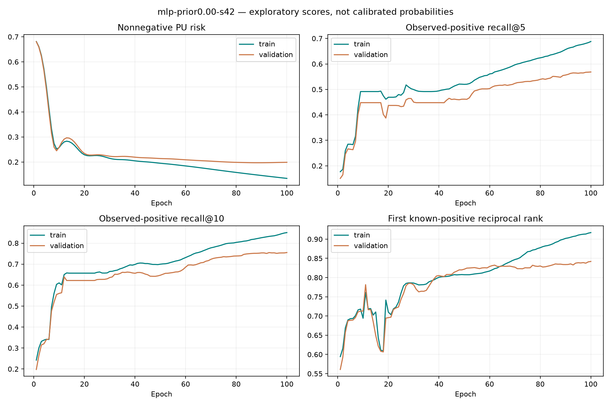
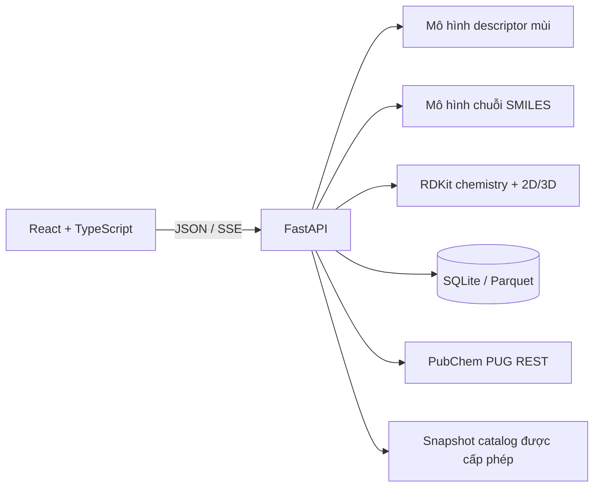

# Scent Molecule Studio

[English](README.md) | **Tiếng Việt**

Phân tích cấu trúc và thiết kế phân tử ứng viên cho nghiên cứu và phát triển
hương liệu.

[](https://github.com/MutAquaticStudio/ai-olfactory-rd-lab/actions/workflows/tests.yml)
[](https://www.python.org/)
[](https://react.dev/)
[](https://fastapi.tiangolo.com/)
[](#giới-hạn-nghiên-cứu)

Scent Molecule Studio là nền tảng nghiên cứu ưu tiên chạy cục bộ, dùng để kiểm
tra cấu trúc chất tạo mùi, xem xét các descriptor mùi được dự đoán, sinh SMILES
ứng viên và thu thập đánh giá cảm quan có thể truy nguyên. Không gian làm việc
React/Vite giao tiếp với một tiến trình FastAPI duy nhất, sử dụng PyTorch và
RDKit ở backend.

Sản phẩm tách riêng bốn loại bằng chứng:

- **Dự đoán** — xác suất của mô hình cho 113 descriptor mùi.
- **Sàng lọc hóa học** — các quy tắc cấu trúc và hóa lý đã cấu hình.
- **Xác minh nguồn tham chiếu** — tra cứu định danh và catalog hương liệu.
- **Bằng chứng thực nghiệm** — đánh giá cảm quan có provenance rõ ràng.

Hệ thống không trình bày cấu trúc được sinh ra như một phân tử đã được xác thực
thực nghiệm và không diễn giải kết quả “không tìm thấy” là tính mới toàn cầu.

## Trạng thái dữ liệu Judge

Catalog đã duyệt được chốt thành snapshot bất biến, có checksum trong Data
Foundation hiện có: **4.729 phân tử, 4.227 connectivity groups**. Split audit
gồm **2.818 / 483 / 717 / 711** phân tử cho train/calibration/validation/locked
test, không overlap connectivity/scaffold. Similarity fingerprint xuyên
partition được báo cáo riêng.

Đã nhập Keller 2016 cục bộ với **1.430.000 dòng measurement**, giữ giá trị và
điều kiện nguồn. Dravnieks còn bị chặn bởi quyền sử dụng. Rating công khai cần
review protocol/mapping trước khi trở thành nhãn train. Cả 113 nhãn trong
snapshot catalog hiện thiếu assessed negative đủ điều kiện.
**Retrain/calibration cho production vẫn bị chặn bởi data gate.** Đã chạy
benchmark CROWN và PU thử nghiệm riêng, không nới gate và không thay weights
production.

[Lệnh tái tạo, quyết định về nguồn và các gate tiếp theo](docs/JUDGE_DATA_RELEASE.md).
Judge v1 tiếp tục ở production; model v2 hiện có tiếp tục ở shadow mode.

### Retrain PU mới nhất — 08/09/2026

Tám lượt chạy so sánh linear Morgan và Morgan MLP với ba giả định prior PU,
cùng các seed bổ sung cho cấu hình được chọn trên validation. Nguồn vẫn là
`AUDIT_ONLY`: nhãn catalog không đề cập **không trở thành assessed negative**.

- 2.875 cấu trúc đã giải quyết stereo; split **1.703 / 296 / 436 / 440**.
- **57/113** vị trí output đủ support để train; 56 vị trí còn lại được đánh dấu
  chưa huấn luyện, không trình bày như descriptor có xác suất bằng zero.
- Model được chọn: **MLP, prior offset 0, seed 42**, best epoch 100.
- Test known-positive **recall@5 0,5687**, **recall@10 0,7658**, **MRR 0,8535**.
- Baseline tần suất từ train: recall@5 **0,4478**. Khoảng tin cậy 95% của delta
  theo bootstrap chemical group: **[+0,0684; +0,1776]**.
- Cải thiện recall@5 so với linear PU được chọn trên validation **chưa rõ ràng
  về thống kê**; seed 17 có kết quả thấp hơn đáng kể.



Recall là khả năng tìm lại **descriptor positive đã được ghi nhận**, không phải
accuracy cảm quan. Test là retrospective, score chưa calibration và model này
**chưa được promote**. Calibration và intensity vẫn chưa đánh giá được.
Learning curve clean-master cũ bên dưới được giữ làm lịch sử của task khác;
không so sánh chỉ bằng giá trị loss.

[Phương pháp, đủ tám lượt chạy và giới hạn](docs/PU_JUDGE_EXPLORATORY.md).
Raw data, checkpoint và weights tiếp tục nằm trong artifact local riêng tư.

```bash
.venv-training/bin/python train_pu_exploratory.py --acknowledge-exploratory
```

## Không gian làm việc

### Phân tích phân tử

- Phân tích và chuẩn hóa chuỗi SMILES bằng RDKit.
- Hiển thị Canonical SMILES, Isomeric SMILES và hình 2D có thông tin lập thể.
- Yêu cầu giải quyết stereo trước khi dự đoán có chirality hoặc dựng 3D.
- Dự đoán 113 descriptor từ Morgan fingerprint 2.048 bit
  (`radius=2`, `useChirality=True`).
- Chiếu output phẳng lên 11 facet chính tương thích với Osmo, texture và
  sensation; output thô khác 0 vẫn có trong phần mở rộng.
- Dựng ensemble ETKDGv3 độ trung thực cao và hiển thị tối đa năm đại diện đã hội
  tụ, được phân cụm RMSD, kèm năng lượng force-field tương đối.
- Báo cáo quyết định sàng lọc hóa học, descriptor, phiên bản model/dataset, độ
  tương đồng với miền huấn luyện và trạng thái tin cậy.

Cấu trúc chưa giải quyết stereo hiển thị tối đa 16 stereoisomer. Dự đoán và 3D
được khóa cho đến khi người dùng chọn một biến thể được xác định đầy đủ. Sau đó,
cùng một Isomeric SMILES được dùng cho cả chiral fingerprint và conformer
pipeline.

### Thiết kế ứng viên

- Chọn tối đa ba descriptor mục tiêu và mức đa dạng khi lấy mẫu.
- Không cho chọn descriptor thiếu support; phân biệt rõ `SUPPORTED` và
  `LIMITED_EVIDENCE`.
- Stream tiến độ sinh và sàng lọc, đồng thời cho phép hủy request.
- Loại cấu trúc lỗi, trùng, chưa giải quyết stereo, bị từ chối, đã biết hoặc chưa
  xác minh trước khi xếp hạng.
- Tự động liệt kê tối đa bốn stereo variant cho mỗi ứng viên và chỉ giữ tối đa
  một đại diện cho mỗi connectivity.
- Chấm điểm pool đã qua chemistry trước PubChem, 3D, academic hoặc route search.
  Artifact SELFIES có điều kiện sau khi được promote sẽ nhận target cùng các
  assessed/intensity mask; Char-LSTM hiện tại vẫn là fallback có công khai.
- Xếp hạng bằng geometric mean đã trừ uncertainty:

```text
conservative_i = max(0, ensemble_mean_i - 1.64 × ensemble_std_i)
Robust target fit = exp(mean(log(conservative_i)))
```

- Với descriptor `SUPPORTED` đã calibration, strict match yêu cầu từng target
  đạt 30% và robust target fit đạt 40%. Descriptor limited-evidence dùng ngưỡng
  calibration riêng, không được diễn giải như xác suất 40/30 tuyệt đối.
- Nếu chưa đủ ba cấu trúc, ngưỡng được hạ công khai theo bước 0,05; kết quả luôn
  mang nhãn `RELAXED`, lưu ngưỡng thực tế và nói rõ chưa đạt yêu cầu ban đầu.
- Hiển thị tối đa ba ứng viên cùng 2D/3D, target evidence, uncertainty,
  applicability domain, reference/academic evidence, Ertl SAscore và route
  evidence AiZynthFinder tùy chọn.
- Giữ các mục cần review hóa học hoặc review nguồn tham chiếu ngoài shortlist.

Vòng lặp dừng khi có năm cấu trúc được chấp nhận, đạt 200 lần thử hoặc hết 120
giây. Kết quả và controls được giữ khi chuyển route trong workspace, nhưng chỉ
tồn tại trong phiên hiện tại và sẽ mất khi refresh toàn bộ trình duyệt.

### Nhập dữ liệu

- Ghi một đánh giá cảm quan mù theo biểu mẫu thủ công.
- Nhập CSV hoặc XLSX theo luồng `Upload → Validate → Preview → Commit`.
- Giữ `PRESENT`, `ABSENT` và `UNASSESSED` là ba trạng thái nhãn riêng biệt.
- Kiểm tra cấu trúc, stereo, từ vựng descriptor, đơn vị, bản ghi trùng, định danh,
  trường thực nghiệm và provenance của nguồn.
- Lưu source record theo kiểu append-only và tạo snapshot Parquet bất biến kèm
  manifest SHA-256.

Dữ liệu khoa học cục bộ mặc định nằm trong `~/.scent-molecule-studio/` và được
loại khỏi Git. Đặt `SCENT_STUDIO_DATA_DIR` nếu cần dùng một vị trí riêng tư khác.

## Kiến trúc



- FastAPI nạp model, vocabulary, taxonomy và tập tham chiếu cục bộ một lần trong
  application lifespan.
- Chế độ production local dùng một worker để không nhân đôi bộ nhớ model và
  Apple MPS.
- FastAPI phục vụ cả `/api/v1/*` và ứng dụng React đã build trên cùng origin.
- Trạng thái sinh ứng viên dùng Server-Sent Events; không cần Redis, Celery hoặc
  background worker.

### Kiến trúc huấn luyện ưu tiên độ chính xác

Tiến trình web thông thường không import DeepChem hoặc Chemprop. Cả Morgan baseline hiện tại
và graph model tương lai cùng triển khai contract `MoleculePredictor` /
`PredictionBatch` trong `olfactory/prediction.py`. Judge v1 đã đăng ký tiếp tục
là model production cho đến khi một candidate vượt qua locked chemical-group
test, calibration, intensity và blind-panel gate.

Các thí nghiệm Judge v2 chạy trong môi trường riêng. Chemprop là graph benchmark
đầu tiên; `olfactory/training/deepchem_judge.py` là adapter DeepChem tùy chọn,
dùng `MolGraphConvFeaturizer(use_edges=True, use_chirality=True)`. Artifact
DeepChem là các candidate bất biến trong `artifacts/judge/<run_id>/`; quá trình
train không ghi đè `odor_predictor_weights.pth` và không tự động promote registry
entry. Chỉ cài môi trường này khi cần:

```bash
python3.11 -m venv .venv-training
source .venv-training/bin/activate
python -m pip install -r requirements-deepchem.txt
```

Tạo split 60/10/15/15 dùng chung một lần và tái sử dụng checksum của nó cho mọi
model:

```bash
python build_split_manifest.py --legacy-baseline
python benchmark_baselines.py --legacy-baseline \
  --split-manifest artifacts/benchmarks/split_manifest.json
```

Các stereo variant được group theo connectivity InChIKey; cấu trúc vòng được
group theo Murcko scaffold, còn cấu trúc acyclic theo độ tương đồng Morgan bằng
Butina. Random split chỉ dùng cho diagnostic. Early stopping chỉ dùng validation;
calibration/threshold chỉ dùng calibration partition; locked test không bao giờ
được dùng để tuning.

Có thể nạp tùy chọn ensemble Chemprop năm seed ở chế độ shadow từ manifest đã
kiểm tra checksum. Kết quả chỉ nằm trong **Molecule analysis → Technical
details** và không được dùng để xếp hạng Candidate Design. Khi bật shadow, chạy
ứng dụng bằng interpreter của môi trường training vì model cần các class
Chemprop:

```bash
export SCENT_STUDIO_JUDGE_SHADOW_MANIFEST=/duong/dan/tuyet/doi/ensemble_manifest.json
PYTHON_BIN=.venv-training/bin/python ./run_local.sh
```

## Yêu cầu hệ thống

- Python `>=3.10,<3.13`
- Node.js 20 trở lên
- macOS, Linux hoặc Windows có được wheel PyTorch/RDKit đã chọn hỗ trợ
- Ưu tiên Apple MPS nếu khả dụng; CPU là fallback

Stack Chemprop chỉ dùng khi huấn luyện hiện yêu cầu Python 3.11–3.12. Ứng dụng web
và baseline inference hỗ trợ Python 3.10–3.12.

## Khởi động nhanh

```bash
git clone git@github.com:MutAquaticStudio/ai-olfactory-rd-lab.git
cd ai-olfactory-rd-lab

python3.12 -m venv .venv
source .venv/bin/activate
python -m pip install --upgrade pip
python -m pip install -r requirements.txt

cd frontend
npm ci
cd ..

# Cấu hình private model bundle (không lưu trong Git)
export SCENT_STUDIO_RESOURCE_DIR="$HOME/.scent-molecule-studio/resources"
# Sao chép ba file đã duyệt vào thư mục này, sau đó tạo checksum manifest:
python scripts/prepare_resource_bundle.py \
  --source /path/to/private/model-bundle \
  --target "$SCENT_STUDIO_RESOURCE_DIR"

PYTHON_BIN=.venv/bin/python ./run_local.sh
```

Mở [http://127.0.0.1:8000](http://127.0.0.1:8000). Production launcher chỉ
bind vào `127.0.0.1` và khởi chạy một Uvicorn worker.

Có thể đổi port hoặc Python interpreter:

```bash
PYTHON_BIN=python3.11 PORT=8080 ./run_local.sh
```

### Chế độ phát triển

Chạy API và Vite dev server trong hai terminal riêng:

```bash
# Terminal 1
.venv/bin/python -m uvicorn olfactory.api:app \
  --host 127.0.0.1 --port 8000 --workers 1

# Terminal 2
cd frontend
npm run dev
```

Trong development, Vite proxy `/api` sang tiến trình FastAPI.

## Tài nguyên mô hình

Ứng dụng production giữ model binary ngoài Git trong một private resource bundle
được xác minh checksum. Hãy đặt `SCENT_STUDIO_RESOURCE_DIR` trỏ tới bundle trước
khi chạy API. Bundle gồm:

| Tài nguyên riêng tư | Contract |
|---|---|
| `odor_morgan_tensor_dataset.pt` | `X [3522, 2048]`, `Y [3522, 113]`, thứ tự nhãn cố định |
| `odor_predictor_weights.pth` | Mô hình descriptor `2048 → 1024 → 512 → 113` |
| `smiles_creator_weights.pth` | Trọng số character LSTM hai lớp |
| `resource_manifest.json` | Checksum SHA-256 của mọi tài nguyên riêng tư |

Dùng `scripts/prepare_resource_bundle.py` để sao chép tài nguyên theo cách atomic
và ghi manifest. Loader kiểm tra mọi checksum trước khi nạp model; không model
binary nào được tự động tải xuống.

Repository chỉ giữ metadata runtime nhỏ và không nhạy cảm:

| Tài nguyên | Contract |
|---|---|
| `clean_dataset.csv` | Cấu trúc tham chiếu cục bộ và metadata mùi từ catalog |
| `smiles_vocab.json` | Character vocabulary có `<PAD>` và `<END>` |
| `model_registry.json` | Metadata model/data/calibration đang hoạt động |

Các trọng số riêng tư hiện tại được đăng ký như scientific baseline legacy. Việc
chuyển giao diện web không retrain hoặc thay đổi chúng. Artifact Judge v2 và
Creator v2 được ghi vào đường dẫn `artifacts/` đã ignore và không bao giờ ghi đè
baseline bundle.

Nếu bundle thiếu hoặc checksum không khớp, `run_local.sh` dừng với hướng dẫn cài
đặt; health endpoint của API trả lỗi tài nguyên ổn định. Hãy giữ bundle ở vị trí
riêng tư và không commit nó.

Thí nghiệm clean-master hiện tại được lưu dưới dạng artifact không phải
production tại `artifacts/judge/clean-master-leakage-v2/` và
`artifacts/creator/clean-master-char-lstm-v1/`. Judge candidate có 254 output
taxonomy và dùng BatchNorm MLP nên được chủ động ngăn nạp bằng production adapter
113 output. Manifest và checksum của candidate được giữ để benchmark và review
có khả năng rollback; không sao chép nó vào private bundle nếu chưa có snapshot
113 nhãn đã audit và chưa vượt quality gate.

### Learning curve của clean-master candidate

Biểu đồ dưới đây thuộc run candidate chống rò rỉ dữ liệu
`judge-clean-master-leakage-v2-20260902`. Các biến thể cùng connectivity luôn ở
cùng một partition; phân tử vòng được group theo Murcko scaffold và phân tử
acyclic theo độ tương đồng Butina. Split cố định gồm 2.781 hàng train, 472 hàng
calibration, 697 hàng validation và 779 hàng locked test.


| Chỉ số đã ghi nhận | Kết quả |
|---|---:|
| Validation BCE loss tốt nhất | `0.1405` tại epoch 24 |
| Validation micro F1 tốt nhất | `0.4445` tại epoch 28 |
| Locked-test BCE loss | `0.1459` |
| Locked-test micro F1 với threshold cố định | `0.4266` |

Các số liệu này mô tả một candidate weak-taxonomy 254 nhãn, không phải model
production 113 nhãn đã đăng ký. Chúng được giữ như bằng chứng huấn luyện có thể
tái lập và bản thân chúng chưa đủ để vượt promotion gate.

### Mức sẵn sàng để retrain

Preflight ngày 2026-09-04 xác nhận file riêng tư
`clean_master_olfactory_db.csv` có 4.729 Isomeric SMILES duy nhất. Hai trường
`odor_types` và `odor_descriptors` hiện mở rộng thành 254 nhãn weak-taxonomy,
trong khi contract dự đoán production yêu cầu đúng 113 descriptor theo thứ tự cố
định. Catalog này ghi nhận mention, chưa phải assessment đã review theo ba trạng
thái `PRESENT / ABSENT / UNASSESSED`, đồng thời chưa có intensity từ panel.

Quyết định của project owner hiện đã xác nhận cả 117 mục trước đây chưa map là
từ vựng nguồn hợp lệ của Osmo v1.2: 5 grand family, 28 subfamily, 64 descriptor,
11 texture và 9 sensation. Chúng được giữ với trạng thái
`SOURCE_TAXONOMY_ONLY`, không bị ép vào 113 target huấn luyện cố định. Review
queue vì vậy đã về 0, nhưng snapshot vẫn chưa đủ điều kiện train vì catalog
omission còn là `UNASSESSED` và chưa có intensity từ panel đã review.

Vì vậy release này **không** khởi chạy hoặc promote một lần retrain production.
Nạp checkpoint 254 output như Judge 113 output sẽ âm thầm đổi API contract và có
nguy cơ biến descriptor không được catalog nhắc tới thành negative không đáng
tin. Trình tự retrain đúng là:

1. Review và version mapping ontology 254 → 113 một cách tường minh; giữ các
   source term chưa map và không suy ra `ABSENT` từ mention bị thiếu.
2. Commit sensory record đã review thành immutable Parquet snapshot 113 nhãn,
   kèm provenance về cấu trúc, nguồn, license, stereo và assessment.
3. Khóa một split connectivity/scaffold 60/10/15/15 rồi benchmark logistic,
   Morgan, Chemprop và DeepChem trên cùng snapshot.
4. Chỉ fit calibration trên calibration partition, chọn model bằng validation,
   và chỉ mở locked test một lần cho so sánh cuối.
5. Chỉ promote ensemble năm seed sau khi vượt gate metric, calibration,
   applicability domain và prospective panel đã công bố.

Trước khi vượt gate này, ứng dụng giữ Judge v1 và Char-LSTM v1 làm production
baseline có thể rollback. Target matching của release này luôn minh bạch: output
chưa calibration được hiển thị là score và không bao giờ được gắn strict match
40/30.

## API

| Endpoint | Mục đích |
|---|---|
| `GET /api/v1/health` | Trạng thái server và tài nguyên model |
| `GET /api/v1/meta` | Nhãn, giới hạn, capability, phiên bản và provider |
| `POST /api/v1/analysis` | Cấu trúc, stereo, screen, prediction và 3D |
| `POST /api/v1/candidates/stream` | Tiến độ SSE và kết quả xếp hạng ứng viên |
| `POST /api/v1/academic/evidence/query` | Truy vấn bằng chứng cấu trúc cục bộ có citation |
| `GET /api/v1/academic/evidence/{evidence_id}` | Lấy một evidence record và provenance |
| `GET /api/v1/academic/sources` | Liệt kê nguồn học thuật đã index |
| `GET /api/v1/data/templates` | Schema intake hoặc CSV template |
| `POST /api/v1/data/imports/validate` | Kiểm tra và stage file CSV/XLSX |
| `POST /api/v1/data/imports/commit` | Commit một import token đã kiểm tra |
| `POST /api/v1/assessments/validate` | Kiểm tra một sensory record thủ công |
| `POST /api/v1/assessments` | Append sensory record đã kiểm tra |
| `GET /api/v1/datasets/versions` | Liệt kê snapshot dataset cục bộ bất biến |

Lỗi sản phẩm dùng mã ổn định và thông báo dễ hiểu. Technical details được thu
gọn trên UI; API response không lộ stack trace.

## Bằng chứng học thuật

Lệnh `academic_rag_pipeline.py ingest` ghi các structure mention đã trích xuất
vào `faiss_academic_index/academic_evidence.jsonl`, nằm cạnh các batch FAISS cục
bộ. Mỗi record giữ paper identifier, DOI/link, content hash, provenance full-text
hoặc abstract, excerpt span, log chuẩn hóa RDKit và trạng thái review. Extraction
chỉ tạo candidate evidence: record bắt đầu ở `UNREVIEWED`, odor descriptor vẫn
là `UNASSESSED` và không PDF/abstract thô nào được tự động đưa vào model training.

Evidence API chỉ nâng lên `EXACT_MATCH` sau khi reviewer chấp nhận định danh RDKit
có xét stereo và citation provenance. Mention chỉ có tên, muối, stereo chưa giải
quyết, xung đột identifier và record chỉ có abstract tiếp tục ở trạng thái cần
review thay vì được coi là exact evidence. Truy vấn mặc định loại abstract
fallback (`include_abstracts=false`).

Academic retrieval ưu tiên chạy cục bộ và fail-closed. Tài liệu open-access là
input tạm thời, được xóa sau khi xử lý; pipeline không vượt paywall và không gửi
toàn văn tới dịch vụ ngoài. Chemistry `PASS` hoặc academic identity match không
phải kết luận về an toàn, IFRA, khả năng tổng hợp, novelty, patent clearance hoặc
xác thực thực nghiệm.

## Chính sách stereo và conformer

Analysis contract có ba trạng thái:

- `STEREO_REQUIRED` — có thể chọn một danh sách variant bị giới hạn.
- `STEREO_INPUT_REQUIRED` — có quá nhiều variant; cần nhập Isomeric SMILES đầy đủ.
- `COMPLETE` — có thể chạy chiral prediction và conformer modeling.

Với cấu trúc hoàn chỉnh, conformer service yêu cầu 50 conformer ETKDGv3, hoặc 100
cho macrocycle được bảo vệ. Pipeline enforce chirality, dùng macrocycle torsion và
1–4 bounds, retry MMFF94s minimization, rồi chỉ fallback sang một UFF ensemble
riêng khi không có MMFF conformer nào hội tụ. Năng lượng từ các force field khác
nhau không bao giờ được trộn.

Conformer có tọa độ không hữu hạn, heavy-atom clash, connectivity thay đổi,
stereo round-trip thay đổi hoặc chưa hội tụ đều bị loại. Các đại diện được phân
cụm theo heavy-atom RMSD và sắp xếp theo năng lượng tương đối. Đại diện đầu tiên
luôn có `ΔE = 0`.

## Gate hóa học và nguồn tham chiếu

Chemistry screen trả về `PASS`, `REVIEW` hoặc `REJECT`. Chỉ `PASS` mới có thể vào
shortlist. Profile macrocycle được bảo vệ cho phép vòng không aromatic 15–17
thành viên trong các giới hạn descriptor riêng.

Eligibility của nguồn tham chiếu dùng chính sách fail-closed:

```text
chemistry PASS
AND PubChem NO_MATCH
AND mọi fragrance catalog đã bật đều NO_MATCH
```

PubChem được truy vấn qua PUG REST `fastidentity` với
`identity_type=same_stereo_isotope`. Không identifier nào được truyền đi trước
khi người dùng đồng ý trong phiên. Kết quả `MATCH`, `AMBIGUOUS` và `UNVERIFIED`
không được vào shortlist.

Adapter TGSC và ScenTree chỉ nhận licensed local snapshot. Hệ thống không scrape
website và giữ trạng thái `NOT_CONFIGURED` nếu operator chưa cung cấp manifest
hợp lệ ngoài Git:

```bash
export TGSC_REFERENCE_MANIFEST=/private/references/tgsc-manifest.json
export SCENTREE_REFERENCE_MANIFEST=/private/references/scentree-manifest.json
```

Kết quả no-match chỉ có nghĩa là không tìm thấy record khớp trong các nguồn đã
cấu hình. Nó không chứng minh novelty toàn cầu, độc quyền thương mại, an toàn hoặc
patent clearance.

## Phát triển khoa học

Cài training stack riêng với Python 3.11–3.12:

```bash
python3.12 -m venv .venv-training
source .venv-training/bin/activate
python -m pip install -r requirements-training.txt
```

Các entrypoint train v1 legacy và CSV trung gian không còn nằm trong production
checkout. Script benchmark v2 đọc private tensor dataset từ
`SCENT_STUDIO_RESOURCE_DIR`; cần đặt biến này trước khi audit hoặc benchmark
legacy baseline.

Các workflow chính:

```bash
# Audit weak-label baseline legacy
python audit_accuracy.py

# Áp dụng quyết định taxonomy-only, không ép source term thành target
python build_master_label_review.py \
  --data /private/path/clean_master_olfactory_db.csv \
  --review-policy data/odor_label_review_v1.json \
  --output artifacts/data/clean-master-113-reviewed-v1 \
  --dataset-version clean-master-113-reviewed-v1

# Baseline trên grouped split cố định, có raw prediction căn hàng
python benchmark_baselines.py --legacy-baseline \
  --split-manifest artifacts/benchmarks/legacy-113-split-v1.json

# Grouped CV năm fold × ba seed cho Judge v2
python benchmark_judge_v2.py --legacy-baseline \
  --split-manifest artifacts/benchmarks/legacy-113-split-v1.json

# DeepChem graph candidate tùy chọn, chỉ trong training environment
python train_deepchem_judge.py --legacy-baseline \
  --split-manifest artifacts/benchmarks/split_manifest.json

# Ensemble shadow năm seed đã calibration; không tự động promote
python train_judge_v2.py --legacy-baseline \
  --split-manifest artifacts/benchmarks/legacy-113-split-v1.json \
  --baseline-manifest artifacts/baselines/<run>/manifest.json

# Ghép lại ensemble từ năm member đã train, không cần retrain
python build_judge_ensemble.py \
  --split-manifest artifacts/benchmarks/legacy-113-split-v1.json \
  --baseline-manifest artifacts/baselines/<run>/manifest.json \
  --member-manifest artifacts/judge/<seed-1>/manifest.json \
  --member-manifest artifacts/judge/<seed-2>/manifest.json \
  --member-manifest artifacts/judge/<seed-3>/manifest.json \
  --member-manifest artifacts/judge/<seed-4>/manifest.json \
  --member-manifest artifacts/judge/<seed-5>/manifest.json

python train_creator_v2.py --snapshot /private/path/data-version.parquet \
  --target-descriptors fruity,floral \
  --target-score-benchmark /private/path/target-score-benchmark.npz
```

Development split group theo connectivity InChIKey, sau đó dùng Murcko scaffold
cho cấu trúc vòng hoặc Butina clustering cho cấu trúc acyclic. Random split chỉ
dùng cho diagnostic. Split bất biến gồm 60% train, 10% calibration, 15%
validation và 15% locked test. Calibration/threshold chỉ fit trên calibration;
early stopping chỉ dùng validation; locked test chỉ được đánh giá sau khi đã
chọn model.

Mỗi run Judge/Creator ghi `learning_curve.png`, lịch sử CSV/JSON, metrics, config,
split metadata và SHA-256 checksum trong artifact directory bất biến. Promotion
Creator còn yêu cầu benchmark conditional so với unconditional cùng ngân sách,
bootstrap CI dương và coverage gate theo số target.

### Kết quả Judge v2 shadow

Ensemble năm seed đã chạy xong trên split chemical-group bất biến với 113 nhãn.
Test partition được ghi rõ `EXPOSED_RETROSPECTIVE_TEST` vì đã từng được xem ở
các vòng phát triển trước; kết quả chỉ dùng để so sánh shadow, không phải bằng
chứng đủ để promote production.

| Chỉ số retrospective locked test | Morgan baseline | Chemprop ensemble | Thay đổi |
|---|---:|---:|---:|
| Macro average precision | 0,3005 | 0,3457 | +15,0% |
| Micro average precision | 0,3188 | 0,3702 | +16,1% |
| Mean label ECE | 0,01325 | 0,01257 | tốt hơn |
| Mean Brier score | 0,02652 | 0,02524 | tốt hơn |

Grouped paired bootstrap cho macro AP delta đạt `0,0406`, với 95% CI
`[0,0274; 0,0577]`. Các gate presence ranking và calibration đều đạt. Promotion
vẫn bị khóa vì intensity chưa thể đánh giá, chưa có prospective blind panel,
test đã từng được mở và weak-label legacy vẫn coi catalog omission là negative.
Learning curve aggregate và gate report dạng máy đọc nằm trong artifact private
của run.

Benchmark development đầy đủ cũng đã chạy grouped cross-validation năm fold với
ba seed (15 holdout). Trung bình ± độ lệch chuẩn đạt `0,3317 ± 0,0368` macro AP,
`0,3670 ± 0,0254` micro AP, `0,01383 ± 0,00152` mean label ECE và
`0,02466 ± 0,00109` mean Brier score. Holdout của từng lượt CV không được dùng
cho early stopping hoặc calibration trong chính lượt đó.

AiZynthFinder là evidence adapter tùy chọn, không phải dependency runtime hay
cam kết tổng hợp. Có thể cấu hình trong môi trường R&D bằng
`SCENT_STUDIO_AIZYNTH_CONFIG`; nếu thiếu, API trả `NOT_CONFIGURED`. SAscore vẫn
là heuristic riêng và không làm thay đổi điểm odor target-fit.

Xem [Giao thức khoa học](docs/SCIENTIFIC_PROTOCOL.md) để biết schema provenance,
panel protocol, benchmark metric, promotion gate, uncertainty, blind-panel
validation và tiêu chí Creator v2.

## Kiểm thử

```bash
# Unit test backend và API contract
.venv/bin/python -m pytest -q

# Unit test frontend và production build
cd frontend
npm test
npm run build

# Workflow trình duyệt desktop/mobile
npx playwright install chromium
npm run test:e2e
```

CI chạy backend test trên Python 3.10 và 3.12, frontend test trên Node 22, bao gồm
Playwright desktop/mobile và accessibility check.

## Cấu trúc dự án

```text
.
├── frontend/                 React, Vite, TypeScript, Vitest, Playwright
├── olfactory/                FastAPI và molecular application services
│   ├── data_foundation/      Intake, provenance, SQLite, snapshot
│   ├── rag/                  RAG service boundary và FAISS batch adapter
│   └── training/             Split, metric, calibration, Chemprop/DeepChem candidate
├── data/                     Taxonomy mapping và source registry metadata
├── docs/                     Scientific protocol và tài liệu nghiên cứu
├── tests/                    Python unit test và API contract test
├── run_local.sh              Production launcher cục bộ bằng một lệnh
└── model_registry.json       Lựa chọn model production theo cách atomic
```

Academic retrieval được cô lập khỏi model training. Compatibility CLI
`academic_rag_pipeline.py` ủy quyền qua `olfactory/rag/`, chỉ lưu FAISS batch cục
bộ và fallback sang abstract khi không có full text open-access được cấp phép.
Văn bản truy xuất là context, không phải sensory label tự động.

## Taxonomy và ghi nhận thành phần

Repository lưu một mapping 113 nhãn tường minh cho **projection tương thích với
Osmo**. Category score dùng weighted maximum; runtime không fuzzy-map label.
Không có hàm ý dự án liên kết với hoặc được Osmo chứng thực.

- [Osmo Scent Taxonomy](https://github.com/osmoai/taxonomy)
- [Thông báo ghi nhận ODbL](data/OSMO_ODBL_NOTICE.md)
- [Mapping có phiên bản](data/odor_taxonomy_mapping_v1_2.json)

Các component Animated Content, Animated List, Spotlight Card và Count Up trong
phạm vi ứng dụng được chuyển thể từ [React Bits](https://www.reactbits.dev/).
Thông báo được lưu tại
[`frontend/src/vendor/reactbits/NOTICE.md`](frontend/src/vendor/reactbits/NOTICE.md).

## Giới hạn nghiên cứu

- Output của model là dự đoán, không phải quan sát cảm quan đã đo.
- Taxonomy projection chỉ tổ chức lại output, không bổ sung bằng chứng.
- 3D ensemble là phép tính force field trong chân không, không phải X-ray, NMR,
  molecular dynamics, DFT hoặc thermodynamic ensemble.
- Sàng lọc hóa học là bước phân loại sơ bộ, không phải đánh giá độc tính, IFRA,
  khả năng tổng hợp, pháp lý hoặc độ bay hơi thực nghiệm.
- Ứng viên được sinh ra cần chuyên gia review và xác thực trong phòng thí nghiệm
  trước khi sử dụng thực tế.
- Weak catalog label chứa dữ liệu thiếu và xung đột; thuật ngữ không được nhắc tới
  không tự động là một quan sát âm.
- Độ tương đồng miền áp dụng và uncertainty là cảnh báo, không phải bảo đảm về độ
  chính xác.
